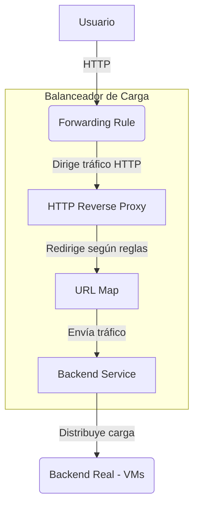

# Laboratorio Práctico de Google Cloud Platform (GCP) : "Implementación de Balanceo de Carga en Compute Engine" (Implement Load Balancing on Compute Engine). 

## Introducción
Este documento describe el proceso de implementación de un balanceador de carga en Google Cloud Platform (GCP), detallando cada paso y los comandos empleados. Es parte de un laboratorio práctico en el que se configuró una infraestructura tolerante a fallos basada en instancias de máquinas virtuales ejecutando NGINX.

### Detalles de la ejecución de comandos

* **Opción 1**: Ejecutar comandos manualmente (Se deben ingresar los comandos uno por uno en la Google Cloud Shell.)  
📄 Archivo: [Comandos para la Implementación de Balanceo de Carga en Compute Engine.txt](https://github.com/LourdesAye/lab_practico_implement_load_balancing/blob/28dc06ad0c7f52fdc1c2ac49cba9aa8e5b54f6a1/Comandos%20para%20la%20Implementaci%C3%B3n%20de%20Balanceo%20de%20Carga%20en%20Compute%20Engine.txt)

* **Opción 2**: Ejecutar el script automáticamente  
📄 Archivo: [despliegue_gcp.sh](https://github.com/LourdesAye/lab_practico_implement_load_balancing/blob/28dc06ad0c7f52fdc1c2ac49cba9aa8e5b54f6a1/Comandos%20para%20la%20implementaci%C3%B3n%20del%20Balanceador%20de%20Cargas.sh)

  Este script automatiza la ejecución de los comandos necesarios para configurar el balanceador de carga. Antes de ejecutarlo, es necesario definir las variables de entorno:

    ```
    # Reemplaza los valores según los indicados en el laboratorio antes de ejecutar
    export INSTANCE="TU_VALOR_AQUI"  # Ejemplo: nucleus-jumphost-624
    export FIREWALL="TU_VALOR_AQUI"  # Ejemplo: accept-tcp-rule-112
    export ZONE="TU_VALOR_AQUI"      # Ejemplo: us-east1-c
    ```

    Finalmente, descarga y ejecuta el script con estos comandos:
    ```
    curl -LO https://github.com/LourdesAye/lab_practico_implement_load_balancing/blob/main/Comandos%20para%20la%20implementaci%C3%B3n%20del%20Balanceador%20de%20Cargas.sh
    chmod +x despliegue_gcp.sh
    ./despliegue_gcp.sh
    ```
    * curl -LO URL :Descarga el script desde GitHub y lo guarda con su nombre original.
    * chmod +x despliegue_gcp.sh → Asigna permisos de ejecución al script.
    * ./despliegue_gcp.sh → Ejecuta el script en la terminal.

## ¿Qué es un Balanceador de Cargas (Load Balancing)?
Un balanceador de carga es un dispositivo o software que distribuye el tráfico de red o las solicitudes de aplicación entre múltiples servidores o recursos disponibles, con el objetivo de optimizar el rendimiento, mejorar la disponibilidad y garantizar la tolerancia a fallos.


Definición de Google: *" The job of a load balancer is to distribute user traffic across multiple instances of an application. By spreading the load, load balancing reduces the risk that applications experience performance issues."*


En este caso, es un servicio brindado por Google Cloud Platform, compuesto por:
* **Forwarding Rule** (recibe el tráfico HTTP (puerto 80) e indica hacia dónde enviarlo: al proxy inverso HTTP. No decide directamente a qué VM o backend va el tráfico, esa decisión la toma el proxy y el URL Map.)
* **Proxy HTTP** (recibe las peticiones HTTP y las reenvía al URL MAP, es un puente entre el balanceador de carga y los Servidores del Backend).
* **URL Map** (indica a dónde deben llegar las solicitudes, en este caso al Backend Service)
* **Backend Service** (capa lógica que define cómo se distribuye el tráfico entre las VMs.). 

## Descripción general de las tareas a realizar en el Lab
Las tareas que se llevaron adelante: 
### Tarea 1. Crear una instancia de máquina virtual para el proyecto. 
Se debía
* Asignar el nombre a la instancia.
* Crear la instancia en la zona.
* Usar un tipo de máquina e2-micro.
* Usar el tipo de imagen predeterminado (Debian Linux).

### Tarea 2. Configura un balanceador de cargas HTTP
Consiste en servir un sitio web a través de servidores NGINX, asegurando que el entorno sea tolerante a errores. Por ello, se crea un balanceador de cargas HTTP con un grupo de instancias de 2 servidores web de NGINX. 
Los pasos a seguir fueron los siguientes:
* Crear un script para instalar y configurar NGINX en las máquinas virtuales, que se ejecutará más adelante: 
```
cat << EOF > startup.sh
#! /bin/bash
apt-get update
apt-get install -y nginx
service nginx start
sed -i -- 's/nginx/Google Cloud Platform - '"\$HOSTNAME"'/' /var/www/html/index.nginx-debian.html
EOF
```
* **Crear una plantilla de instancias** (consiste en establecer la configuración de un conjunto de máquinas virtuales, que van a trabajar juntas como si fueran un único sistema, a aprtir del script).
* **Crear un grupo de instancias administrado basado en la plantilla** (Consiste en crear un grupo de instancias de máquinas virtuales a partir de la plantilla anterior).
* **Crear una regla de firewall para permitir el tráfico (80/tcp)**. Notar que en Google Cloud Platform ya se tiene un Firewall con una configuración predeterminada y hay que ajustarla a las necesidades.
* **Crear una verificación de estado (Health Check)**. Consiste en una prueba automatizada que verifica si las máquinas virtuales están funcionando (si NGINX responde HTTP).
* **Crear un servicio de backend** (una capa lógica dentro del balanceador de cargas que aplica verificaciones de estado o health checks a cada máquina virtual para distribuir el tráfico), al cual se agregará el grupo de instancias (máquinas virtuales) como backend real con el puerto http:80. Es decir, hay que configurar los puertos de las máquinas virtuales para que sean accesibles desde el balanceador de carga, crear el Servicio de Backend y agregarle las máquinas virtuales.
* **Crear un mapa de URL y un proxy inverso HTTP, asociarlos y enrutar las solicitudes entrantes al servicio de backend.**
* **Crea una regla de reenvío** (indica a dónde debe ir el tráfico que le llega al balanceador de cargas).

Flujo del proceso: 
1.	Usuario en navegador haciendo las peticiones HTTP (ingresar a un sitio web) 
2.	Ahora entra en acción el Balanceador de carga:
    1.	**Forwarding Rule**: Recibe la solicitud HTTP y la pasa al proxy inverso HTTP
    2.	**Proxy Inverso HTTP**: consulta el URL Map para ver a dónde debe ir el tráfico. 
    3.	**URL Map**: dice que la solicitud debe ir al Backend Service.
    4.	**Backend Service**: distribuye el tráfico a las VMs.
3.	Grupo de VMs que ejecutan NGINX y que responden con la página web (a ellas se les aplica el Health Check para verificar si funcionan de manera adecuada): 
    1.	VM 1 (con NGINX)  
    2.	VM 2 (con NGINX)
4.	Se selecciona a una VM que se encarga de responder al usuario.
5.	Respuesta enviada al usuario.


```mermaid
graph TD;
    Usuario -->|HTTP| A(Forwarding Rule)
    
    subgraph "Balanceador de Carga"
        A -->|Dirige tráfico HTTP| B[HTTP Reverse Proxy]
        B -->|Redirige según reglas| C[URL Map]
        C -->|Envía tráfico| D[Backend Service]
    end
    
    D -->|Distribuye carga| E(Backend Real - VMs)
```

## Pasos detallados que fueron realizados en el Lab
1. Definir variables de entorno (accesibles dentro de la misma sesión de terminal y utilizadas para evitar la repetición de valores en los comandos).
```
export INSTANCE=nucleus-jumphost-624 
export FIREWALL=accept-tcp-rule-112
export REGION=us-east1
export ZONE=us-east1-c
```
* INSTANCE almacena el nombre de la instancia de máquina virtual (VM).
* FIREWALL almacena el nombre de la regla de firewall.
* REGION y ZONE definen la ubicación donde se ejecutarán los recursos en GCP.

> [!NOTE]
> 1. Los valores de las variables de entorno son proporcionadas por el laboratorio al momento de su realización.
> 2. ¿Por qué definir zona y región?   
> GCP divide su infraestructura en regiones (conjuntos de centros de datos) y dentro de cada región hay zonas.  
> Por ejemplo: la región “us-central1” corresponde a una región en el centro de Estados Unidos que tiene las zonas us-central1-a, us-central1-b, us-central1-c y us-central1-f.
> La zona determina en qué centro de datos específico se aloja la VM.    
> Un disco persistente y una instancia de máquina virtual deben ubicarse en la misma zona para poder conectarlos.   
> Esto es importante por:  
> Latencia y disponibilidad: Si tu app tiene usuarios en EE.UU., conviene elegir una zona cercana.  
> Redundancia: Si un centro de datos falla, otras zonas pueden seguir funcionando.  
> Información sobre las regiones y zonas: [Regiones](https://cloud.google.com/docs/geography-and-regions?hl=es-419) y [Zonas](https://cloud.google.com/compute/docs/regions-zones?hl=es-419)  

2. Creación de una Máquina Virtual (VM) en Google Cloud: 
```
gcloud compute instances create $INSTANCE \
    --zone=$ZONE \
    --machine-type=e2-micro
```
* ```gcloud compute instances create``` crea una máquina virtual (VM) en Google Cloud.
* $INSTANCE es el nombre de la VM, tomado de la variable de entorno.
* --zone=$ZONE define en qué zona geográfica se creará la VM.
* --machine-type=e2-micro define el tipo de máquina.

> [!NOTE]
> ¿Qué es e2-micro?  
> Es un tipo de máquina con: 2 vCPUs compartidas y 1 GB de RAM. Adecuada para pruebas y pequeños servidores.

3. Generar un script para crear y ejecutar un archivo de inicio llamado startup.sh, que va a permitir la instalación y configuración de Nginx en una máquina virtual.
```
cat << EOF > startup.sh
#! /bin/bash
apt-get update
apt-get install -y nginx
service nginx start
sed -i -- 's/nginx/Google Cloud Platform - '"\$HOSTNAME"'/' /var/www/html/index.nginx-debian.html
EOF
```

* cat es para escribir un bloque de texto en un archivo startup.sh.
* EOF es un delimitador que indica dónde comienza y termina el contenido a copiar en el archivo startup.sh.
* ">" redirige la salida al archivo startup.sh, sobrescribiéndolo (si existía).
* #! : Especifica que el archivo es un script e indica qué programa debe usarse para ejecutarlo (intérprete)
  * Ejemplo 1: #!/bin/sh → Usa el shell sh (menos funciones que Bash, pero más rápido).
  * Ejemplo 2: #!/usr/bin/python3 → Usa Python 3 como intérprete.
  * Ejemplo 3: #!/usr/bin/env node → Usa Node.js como intérprete.
* ```apt-get update```: Actualiza la lista de paquetes disponibles en el sistema.
* ```apt-get install -y nginx```: Instala el servidor web Nginx. ```-y``` evita que el sistema pida confirmación ("¿Quieres instalar nginx? [y/n]"), aceptando automáticamente.
* ```service nginx start```: Inicia el servidor Nginx, haciendo que la página web sea accesible.
* sed es un editor de texto en línea de comandos.
* -i edita el archivo directamente (sin -i, solo mostraría el cambio sin aplicarlo).
* 's/nginx/Google Cloud Platform - '"$HOSTNAME"'/': reemplaza la palabra "nginx" en el archivo con "Google Cloud Platform - $HOSTNAME", recordando que $HOSTNAME es una variable que contiene el nombre de la máquina virtual.
* /var/www/html/index.nginx-debian.html: Es la página principal que se muestra cuando accedes a la IP de la VM.

> [!NOTE]
> ¿Qué es Nginx y para qué se usa?  
> Nginx es un servidor web y proxy inverso.  
> Servidor web: Es un software que escucha solicitudes HTTP y las responde enviando páginas web a los clientes (en sus navegadores).  
> Proxy inverso: Es un intermediario que recibe peticiones y las reenvía a servidores internos. Se usa para balanceo de carga, seguridad y caché.    
>
>  Ejemplo:  
> Si visitas www.ejemplo.com, el servidor web te envía la página.
> Si hay muchas visitas, un proxy inverso reparte las solicitudes entre varios servidores para evitar sobrecargas.  
>
> En este caso:
> * Nginx es el software del servidor web.
> * Se instala en una máquina virtual (VM).
> * Recibe peticiones HTTP de los usuarios y envía la página web solicitada.


4. Crear un Template de Instancia
```
gcloud compute instance-templates create web-server-template \
        --metadata-from-file startup-script=startup.sh \
        --machine-type e2-medium \
        --region $REGION
```

* web-server-template: Es el nombre del template (puede tener cualquier nombre).
* --metadata-from-file startup-script=startup.sh: permite incluir un script de inicio (startup.sh, el cual fue creado en el paso 3, el paso anterior) que se ejecutará cuando una VM arranque. Este script permite instalar y configurar Nginx en la máquina virtual (MV).
* --machine-type e2-medium: Define el tipo de máquina virtual (2 vCPUs y 4GB de RAM).
* --region $REGION: Especifica la región donde se creará la instancia cuando se use el template.

> [!NOTE]
> Un template de instancia es una plantilla que define la configuración base que van a tener las máquinas virtuales (VMs) a crear.
> No crea VMs, solo guarda la configuración para usarse después.
> Permite crear múltiples VMs con la misma configuración de forma automática. Si se necesita escalar el número de servidores, se puede usar esta plantilla sin redefinir los parámetros cada vez.

5. Crear de un Grupo de Instancias
```
gcloud compute instance-groups managed create web-server-group \
        --base-instance-name web-server \
        --size 2 \
        --template web-server-template \
        --region $REGION
```

Aquí se están creando un grupo de instancias gestionadas (Managed Instance Group, MIG). Se trata de un conjunto de máquinas virtuales que trabajan juntas como si fueran un solo sistema.  
Un grupo de instancias administrado (MIG) puede autoescalar y reemplazar VMs fallidas sin intervención manual, asegurando alta disponibilidad.
Las VMs dentro del grupo se crean a partir del template que se definio en el paso anterior (Paso 4). 

* web-server-group: Es el nombre del grupo de instancias.
* --base-instance-name web-server: Define el prefijo de los nombres de las VMs. Si tiene varias instancias quedaría, por ejemplo, web-server-abc123 y web-server-def456
* --size 2: Crea 2 instancias dentro del grupo.
* --template web-server-template: Usa el template que creado antes (en el Paso 4) (web-server-template). Aquí es cuando se crean realmente las VMs, siguiendo la configuración del template.
--region $REGION: Especifica en qué región se van a desplegar estas VMs.
  
Resumen:
* Antes (Paso 4) se creó una plantilla (pero no VMs).
* Ahora (Paso 5) se usa la plantilla para crear 2 VMs dentro de un grupo de instancias.

6. Crear regla de firewall que permita tráfico HTTP en el puerto 80.
```
gcloud compute firewall-rules create $FIREWALL \
        --allow tcp:80 \
        --network default
```  
Un firewall es un sistema de seguridad que filtra y controla el tráfico de red basado en reglas.  
En Google Cloud hay un firewall predeterminado que bloquea casi todo el tráfico excepto SSH, RDP y ICMP.    
Este comando crea una regla para habilitar el tráfico HTTP en el puerto 80.

En Google Cloud Platform, cada cuenta tiene una red predeterminada llamada "default". Es la red en la que se crean todos los recursos (VMs, balanceadores de cargas, etcétera) en caso de no especificar otra.  

7. Crear un Health Check   
```
gcloud compute http-health-checks create http-basic-check
```          
Un Health Check es una prueba automática que verifica si las VMs están funcionando (revisa si Nginx está respondiendo en HTTP). El health check envía solicitudes HTTP a cada VM. Si una VM responde correctamente, el balanceador sigue enviándole tráfico. Pero si una VM no responde o falla, el balanceador la deja de usar. 

Ejemplo:  
El health check revisa http://web-server-1/ cada 10 segundos.  
Si devuelve un código 200 → ✅ → La VM está en buen estado.
Si no responde → ❌ → Se retira del balanceador hasta que vuelva a estar disponible.

8. Configurar los puertos en las máquinas virtuales
```
gcloud compute instance-groups managed \
        set-named-ports web-server-group \
        --named-ports http:80 \
        --region $REGION
```
Este comando asigna un puerto lógico ('http') al puerto físico (80) en todas las máquinas virtuales del grupo de instancias, que es un conjunto de VMs que operan juntas como si fueran un solo sistema.
Es necesario para que el balanceador de carga sepa a qué puerto enviar el tráfico.
No cambia nada dentro de las VMs, solo las hace "descubribles" por el balanceador.

* ```set-named-ports```: Asigna un nombre lógico ("http") a un puerto real (80).
* ```web-server-group```: El grupo de instancias (conjunto de máquinas virtuales que operan juntas como si se tratara de un solo sistema) donde se aplicará esta configuración.
* ```--named-ports http:80 ```: Le dice a GCP que el servicio llamado "http" está en el puerto 80 de todas las instancias (de cada máquina virtual).
* ```--region $REGION```: Se aplica a todas las VMs dentro de ese grupo en la región especificada.

Este comando es importante porque:
* le permite al balanceador de carga encontrar el puerto correcto en cada VM.
* Hace que las VMs dentro del grupo sean accesibles mediante HTTP (puerto 80).
* Facilita la administración de tráfico sin necesidad de configurar cada VM manualmente.

9. Crear un servicio de backend

```
gcloud compute backend-services create web-server-backend \
        --protocol HTTP \
        --http-health-checks http-basic-check \
        --global
```
Un Backend Service NO es un servidor físico ni una VM, sino una configuración que le dice al balanceador de carga cómo distribuir el tráfico entre las VMs. 
* --protocol HTTP : utiliza HTTP como protocolo.
* --http-health-checks http-basic-check : utiliza el health checks para saber qué VMs están funcionando correctamente.
* --global: servicio de backend está disponible en todas las regiones.

10. Agregar el grupo de instancias (VMs que trabajan juntas) al backend. 
```
gcloud compute backend-services add-backend web-server-backend \
        --instance-group web-server-group \
        --instance-group-region $REGION \
        --global
```
* El web-server-backend es la configuración lógica del tráfico.
* El web-server-group es el grupo de instancias (las VMs con NGINX).
* --instance-group-region $REGION indica la región donde están las VMs.
* --global confirma que el backend service es global.

En el paso anterior (Paso 9) se creó el Backend Service (web-server-backend).  
Ahora, se le indica cuáles son las VMs a usar para responder tráfico.
Se le esta indicando al backend que su "backend real" (quien va a recibir las solicitudes HTTP) es el grupo de instancias (VMs).

Ejemplo de flujo hasta el momento:
1. Un usuario escribe en su navegador: http://mi-app.com . Esto envía una solicitud HTTP al balanceador de carga.
2. El balanceador de carga recibe la solicitud y su trabajo es decidir a qué servidor enviar la solicitud. Pero el balanceador no se conecta directamente a las VMs, sino que primero consulta el Backend Service.
3. El Backend Service decide a qué VM enviar la solicitud. Es un intermediario entre el balanceador de carga y las VMs. Sabe qué VMs están sanas (gracias al Health Check). Distribuye la carga entre las VMs activas.
4. La solicitud llega a una VM. Cada VM tiene NGINX instalado (gracias al script de inicio). NGINX responde con la página web que el usuario quiere ver.

El esquema sería: Usuario en navegador -> Balanceador de carga  ->  Backend Service -> Grupo de VMs: VM 1 (con NGINX) ✅ , VM 2 (con NGINX) ✅ , VM 3 (con NGINX) ❌ (falló el health check)  ->  VM 2 (con NGINX) ✅  ->  Respuesta enviada al usuario. 

> [!NOTE]
> Un grupo de instancias es un conjunto de VMs gestionadas juntas, permitiendo escalabilidad y alta disponibilidad:
> * Si el tráfico aumenta, puede crear más VMs
> * Si el tráfico baja, puede eliminar VMs para ahorrar costos

11.  Crear un URL map
```
gcloud compute url-maps create web-server-map \
        --default-service web-server-backend
```
* gcloud compute url-maps create: Comando para crear un URL Map en GCP.
* web-server-map: Nombre del URL Map que se esta creando.
* --default-service web-server-backend: Indica que todas las solicitudes se enviarán a web-server-backend (nuestro servicio de backend con las VMs).

Con esta instrucción se le indica al balanceador de cargas que cualquier solicitud debe enviarse a web-server-backend (Backend Service). 
El Backend Service redirige tráfico a `web-server-group` (conjunto de VMs que trabajan juntas conformando un solo sistema), para que una VM responda la solicitud HTTP.

12. Crear un proxy inverso HTTP.
```
gcloud compute target-http-proxies create http-lb-proxy \
        --url-map web-server-map
```

* target-http-proxies create : Crea un proxy HTTP en GCP.
* http-lb-proxy: Nombre del proxy HTTP que estamos creando.
* --url-map web-server-map: Le indica al proxy qué URL MAP usar para decidir cómo enrutar el tráfico (es decir, para indicar a dónde denen llegar las solicitudes).

> [!NOTE]
> Proxy inverso: Es un intermediario que recibe solicitudes y las reenvía o distribuye entre los servidores internos
> (en este caso, sobre el Backend Service).
> Un proxy normal recibe las solicitudes de un usuario y las reenvía a Internet, ocultando la identidad del usuario. Un proxy inverso, en cambio, recibe las solicitudes en nombre de los servidores internos y decide a cuál de ellos enviarlas. En este caso, el balanceador de carga actúa como proxy inverso

13.  Crear la regla de reenvío (forwarding rule)
```
gcloud compute forwarding-rules create http-content-rule \
      --global \
      --target-http-proxy http-lb-proxy \
      --ports 80
```
* forwarding-rules create: crea una regla de reenvío en GCP.
* http-content-rule: nombre de la regla de reenvío.
* --global: la regla es global (funciona en múltiples regiones).
* --target-http-proxy http-lb-proxy: indica que el tráfico debe ser manejado por el proxy HTTP que se creo antes.
* --ports 80: especifica que esta regla aplica a tráfico HTTP (puerto 80).

Con este comando se está definiendo la regla de forwarding (de reenvío) que decide a dónde debe ir el tráfico entrante (al proxy HTTP : http-lb-proxy). También, epecifica que este tráfico entrará por el puerto 80 (HTTP).
("Si alguien entra al sitio web en el puerto 80, envíra su solicitud al proxy http-lb-proxy para que la procese.")

14. Verificar la configuración de reglas de reenvío (qué tráfico se dirige y hacia dónde).
```
gcloud compute forwarding-rules list
```
Con esta instrucción, se muestran todas las reglas de forwarding creadas en GCP.Por lo tanto, permite verificar que la regla http-content-rule se creó correctamente.

## Conclusión
Con este laboratorio, se logró implementar un balanceador de carga en Google Cloud Platform utilizando una configuración basada en NGINX. Se demostraron conceptos clave como la distribución de tráfico, la redundancia y la configuración de firewall, lo que permite una arquitectura escalable y tolerante a fallos.
